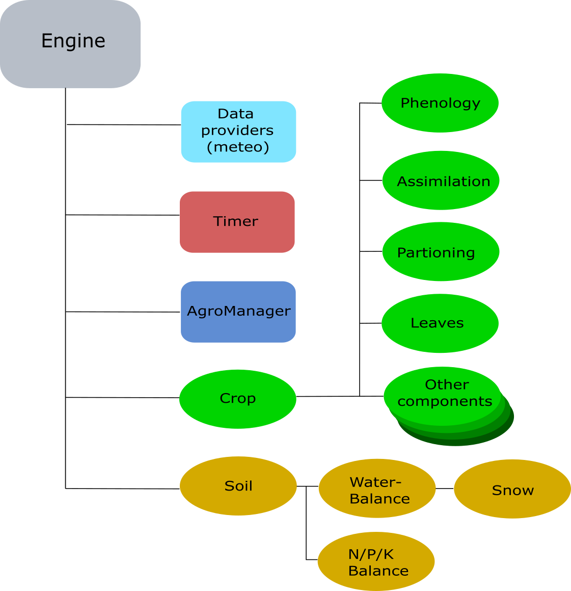

## Biofuel Feedstock Forecasting: BSc Thesis

Finishing up my BSc in International Land & Water Management at WUR,
I have interned within the Earth Observation & Environmental Informatics Group at Wageningen Environmental Research.

Under the supervision of Dr. Allard de Wit, Dr. Berien Elbersen and Dr. Klaas Metselaar I have written my thesis on
"European Marginal Lands as Biofuel Feedstock: Modelling Miscanthus Productivity", for which I received an 8.5/10.

In this repository you can find how I parameterized two genotypes, namely Miscanthus Giganteus and Miscanthus Sinensis within the Python Crop Simulation Environment (PCSE)
of WOrld FOod Studies (WOFOST) model. Further, I was able to run the WOFOST crop growth model using weather and soil input.

Both genotypes were validated using their end-of-season harvest yields at their respective observational sites in Greece and the Netherlands provided by the partner-institutions within the EU-Horizon MIDAS project. Further, a global sensitivity analysis has been done regarding the most sensitive parameters wrt. the biomass yield output of Miscanthus Sinensis.

The structure of this repo consists of a "giganteus", "sinensis" and "marginal_simulations_eu" directories. The genotype directories both consist of notebooks that fetch or process or initialize input data for the model (found in the calibration sub-directories). Further, these models then are run, whereas they simulate the yields of the different genotypes and validate them against their respective observations. Afterwards, these validated crop models are further used on a European scale, to simulate biomass yields in regions characterised by a high percentage of marginal lands.

This thesis represents the initial work of bringing in a perrenial biomass crop within WOFOST. Please find my thesis document attached for more information.

More information about the model, the envrionment, and techniques used here can be found at : https://github.com/ajwdewit

  

  PCSE Engine structure. Figure from the
  <a href="https://pcse.readthedocs.io/en/stable/reference_guide.html">PCSE Reference Guide</a>,
  © Allard de Wit. Reproduced for illustration.

